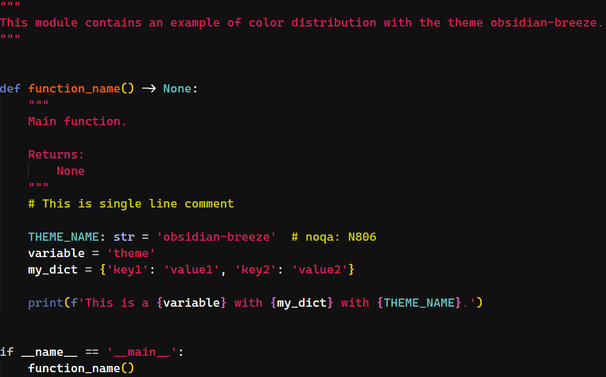

# Obsidian Breeze

## Introduction

Obsidian Breeze is a refined adaptation of the original [Rainglow GitHub Contrast Theme](https://github.com/rainglow/vscode) by Dayle Rees, designed to offer a sleek, visually pleasing experience. It maintains the elegant contrasts of the original theme, with several tweaks for improved readability and a modernized terminal color palette.

## Features
- Dark theme with carefully tuned contrasts for clear visibility.
- Custom terminal colors that enhance the overall look and feel.
- Ideal for developers who prefer minimal distraction while maintaining style.

## Theme Color Visualization

Below is a screenshot of a simple Python script that demonstrates how the colors from the `obsidian-breeze` theme are applied in the code. 

The script uses colors like Cyan, Yellow, Green, Red, and Magenta to display different types of text. This image provides a quick overview of how these colors appear in the theme.

## Installing the Theme

### Easy Path

You can find [Obsidian Breeze](https://marketplace.visualstudio.com/items?itemName=guillem-ps.obsidian-breeze) in the Visual Studio Code marketplace. You are free to use or modify it, and positive feedback is always appreciated. 😉

### Manual Installation

To install the theme manually, follow these steps:

1. Go to the original repository [Obsidian Breeze Theme](https://github.com/guillem-ps/.dotfiles) and clone it. This repository contain multiple tools that I use and you can check.
2. Copy the `obsidian-breeze` folder to your VS Code extensions directory:
   - On Windows: `C:\Users\<Your Username>\.vscode\extensions\`
   - On macOS/Linux: `~/.vscode/extensions/`
3. Restart Visual Studio Code.
4. Go to `File > Preferences > Color Theme` and select `Obsidian Breeze` from the list.

